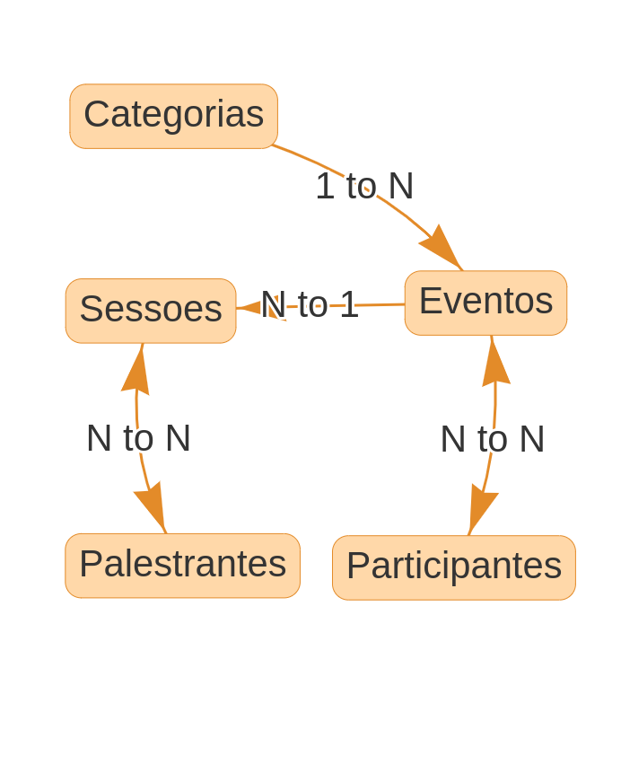

# Event Pro Banco de dados

Este projeto foi desenvolvido como parte de um trabalho acadêmico para a disciplina de Banco de Dados. O objetivo do projeto é criar um sistema de gerenciamento de eventos para uma empresa fictícia chamada "EventPro".

## Estudo de caso

Sua equipe foi contratada para desenvolver um sistema de gerenciamento de eventos para uma empresa
de organização de conferências chamada 'EventPro'. A 'EventPro' é responsável por planejar e realizar
diversos eventos, como conferências, workshops e seminários, em diferentes cidades.

Cada evento possui um identificador único, nome, descrição, data de início, data de término, local e
informações adicionais. Além disso, cada evento está associado a uma categoria específica, como tecnologia,
negócios, saúde, etc.

Os participantes podem se inscrever nos eventos oferecidos pela 'EventPro'. Cada participante possui um
ID único, nome, endereço, informações de contato e histórico de participação em eventos anteriores. Os
participantes podem se inscrever em vários eventos e um evento pode ter vários participantes.

Durante um evento, várias sessões são realizadas simultaneamente. Cada sessão possui um identificador
único, título, descrição, horário de início, horário de término e local dentro do evento. Uma sessão está
associada a um único evento e um evento pode ter várias sessões.

Os palestrantes são profissionais convidados para ministrar palestras durante as sessões dos eventos. Cada
palestrante possui um ID único, nome, biografia e informações de contato. Um palestrante pode ministrar
palestras em várias sessões e uma sessão pode ter vários palestrantes.

## Desenvolvimento do Trabalho

Baseado no estudo de caso atribuído à equipe, os seguintes itens devem ser apresentados:

- Um M.E.R.: a equipe deverá produzir um M.E.R. que represente adequadamente o domínio escolhido, atendendo às informações e restrições impostas pelo estudo de caso e que devem ser consideradas por um BD. Durante a apresentação, a equipe deverá justificar suas escolhas pelas representações do diagrama. Além disto, esclarecimentos sobre estas escolhas poderão ser solicitados pela professora ou pela turma durante a apresentação. Deverá ser usada a notação vista em sala de aula para a representação de um M.E.R..
- Um esquema relacional: a equipe deverá converter o M.E.R. para um esquema relacional. Durante a apresentação, a equipe deverá justificar suas escolhas pelas representações no esquema relacional. Além disto, esclarecimentos sobre estas escolhas poderão ser solicitados pela professora ou pela turma durante a apresentação.
- Consultas escritas em SQL: elaborar 3 consultas que a equipe julgar interessante para o estudo de caso e apresentar o resultado da consulta na ferramenta MySQL, no momento da apresentação. Portanto, é importante que as tabelas sejam populadas antecipadamente.

## Exigências

As equipes deverão considerar todas as informações e restrições identificadas no estudo de caso para a produção dos esquemas conceitual (M.E.R.) e lógico (relacional). Quando não for possível representar alguma restrição no esquema conceitual ou no esquema lógico, deverão ser inseridas observações abaixo
dos esquemas. A equipe poderá incrementar seus esquemas considerando novas informações e restrições que possam melhorar o esquema, desde que este incremento não afete as restrições exigidas pelo estudo de caso.

## Avaliação

Serão avaliados os seguintes pontos:

- A boa estruturação dos esquemas M.E.R. e Relacional;
- O cumprimento de todas as exigências acima;
- O grau de utilização dos conceitos vistos na disciplina de BAN;
- Criatividade na definição dos esquemas;
- A pertinência dos esclarecimentos da apresentação oral;
- A clareza e organização da apresentação;
- O grau de complexidade e importância para o estudo de caso das consultas SQL elaboradas pela equipe.

## Desenvolvimento do trabalho

### M. E. R.

### Esquema Relacional

- Categorias

  - categoria_id (INT, PRIMARY KEY)
  - nome_categoria (VARCHAR(255))

- Eventos

  - evento_id (INT, PRIMARY KEY)
  - nome (VARCHAR(255))
  - descricao (VARCHAR(255))
  - data_inicio (DATE)
  - data_fim (DATE)
  - local (VARCHAR(255))
  - informacoes_adicionais (VARCHAR(255))
  - categoria_id (INT, FOREIGN KEY REFERENCES Categorias(categoria_id))

- Participantes

  - participante_id (INT, PRIMARY KEY)
  - nome (VARCHAR(255))
  - endereco (VARCHAR(255))
  - informacoes_contato (VARCHAR(255))

- Evento_Participantes

  - evento_id (INT, FOREIGN KEY REFERENCES Eventos(evento_id))
  - participante_id (INT, FOREIGN KEY REFERENCES Participantes(participante_id))
  - PRIMARY KEY (evento_id, participante_id)

- Sessoes

  - sessao_id (INT, PRIMARY KEY)
  - titulo (VARCHAR(255))
  - descricao (VARCHAR(255))
  - hora_inicio (TIME)
  - hora_fim (TIME)
  - local (VARCHAR(255))
  - evento_id (INT, FOREIGN KEY REFERENCES Eventos(evento_id))

- Palestrantes

  - palestrante_id (INT, PRIMARY KEY)
  - nome (VARCHAR(255))
  - biografia (TEXT)
  - informacoes_contato (VARCHAR(255))

- Sessao_Palestrantes

  - sessao_id (INT, FOREIGN KEY REFERENCES Sessoes(sessao_id))
  - palestrante_id (INT, FOREIGN KEY REFERENCES Palestrantes(palestrante_id))
  - PRIMARY KEY (sessao_id, palestrante_id)

### Consultas SQL

[Consultas SQL](SQL/Consultas.sql)

## Contribuição

Este projeto foi desenvolvido como parte de um trabalho acadêmico e não está aberto para contribuições externas.
